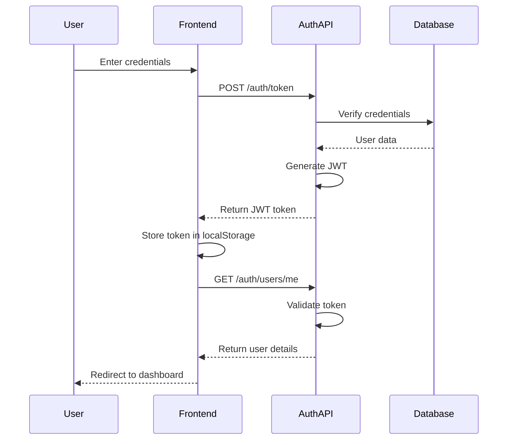
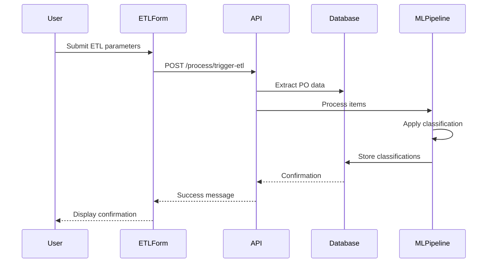
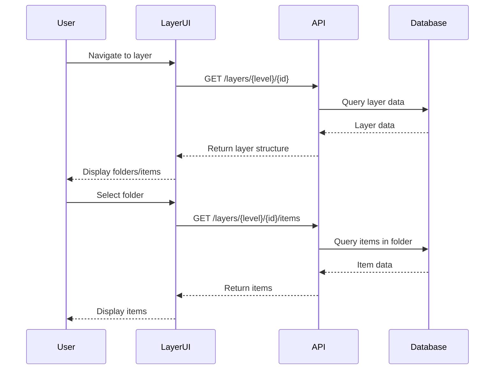
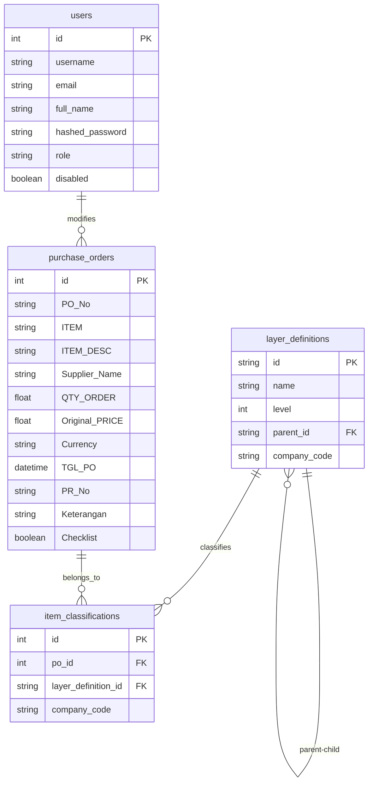

# Foldering AI - Architecture Analysis

## 1. Overall Application Overview

### Purpose of the Application
Foldering AI is an intelligent folder management and organization system designed to automatically categorize and organize purchase order (PO) data. The application processes purchase orders, applies machine learning techniques to classify items into appropriate categories (folders), and provides a user interface for managing and reviewing these classifications.

### Target Users/Personas
- **Procurement Specialists**: Users who need to organize and categorize large volumes of purchase orders
- **Supervisors (SPV)**: Users with elevated permissions who can approve classifications and perform quality checks
- **Regular Users**: Staff who can view and annotate purchase order data

### Core Existing Features and Functionalities
- Purchase Order Management: Import, view, and manage purchase order data
- Automatic Classification: ML-based categorization of items into hierarchical folders (L1, L2)
- Role-based Access Control: Different permissions for regular users and supervisors
- Notes Management: Ability to add and edit notes (Keterangan) for purchase orders
- Checklist Functionality: Supervisors can mark items as checked/verified
- ETL Process: Data extraction, transformation, and loading from external systems
- Dashboard: Overview of key metrics and system status

## 2. Software Architecture Analysis (Architect's View)

### High-level Architecture
The application follows a client-server architecture with a clear separation between frontend and backend components:

- **Frontend**: Next.js-based web application (React framework)
- **Backend**: FastAPI-based REST API service
- **Database**: MySQL database for persistent storage
- **ML Component**: Python-based machine learning pipeline for classification

### Key Technology Stack

#### Frontend
- **Framework**: Next.js (React)
- **Language**: TypeScript
- **UI Components**: Custom UI components built with Tailwind CSS, and Shadcn UI 
- **State Management**: React Context API
- **Data Fetching**: Native fetch API
- **Authentication**: JWT-based authentication
- **Form Handling**: React Hook Form with Zod validation
- **Data Tables**: TanStack Table (React Table)
- **PDF Generation**: jsPDF and jspdf-autotable

#### Backend
- **Framework**: FastAPI (Python)
- **Database Access**: MySQL Connector
- **Authentication**: JWT with OAuth2 password flow
- **API Documentation**: Swagger UI (via FastAPI)
- **Environment Management**: python-dotenv

#### Machine Learning
- **Language**: Python
- **Data Processing**: Pandas
- **Text Processing**: Regular expressions for parsing
- **Database Integration**: Direct SQL queries for data access

### Directory Structure Overview

```
.
├── backend/                  # Backend Python code
│   ├── api/                  # FastAPI application
│   │   ├── core/             # Core functionality (auth, security)
│   │   ├── db/               # Database connections
│   │   ├── routers/          # API endpoints
│   │   ├── schemas/          # Pydantic models
│   │   └── services/         # Business logic
│   ├── etl/                  # ETL scripts
│   └── ml/                   # Machine learning models and scripts
├── frontend/                 # Next.js frontend
│   ├── public/               # Static assets
│   └── src/                  # Source code
│       ├── app/              # Next.js app directory
│       │   ├── (auth)/       # Authentication pages
│       │   └── (dashboard_layout)/ # Dashboard and main application pages
│       ├── components/       # React components
│       │   ├── custom/       # Application-specific components
│       │   └── ui/           # Generic UI components
│       ├── context/          # React context providers
│       └── lib/              # Utility functions and API clients
├── .env                      # Environment variables
└── requirements.txt          # Python dependencies
```

### Main Components/Modules and Their Responsibilities

#### Backend Components
1. **API Core (`backend/api/core/`)**: 
   - Security implementation (JWT, password hashing)
   - Dependency injection for authentication
   - Role-based access control

2. **Database Layer (`backend/api/db/`)**: 
   - Database connection management
   - SQL query execution

3. **API Routers (`backend/api/routers/`)**: 
   - Authentication endpoints
   - Purchase order management
   - Classification management
   - Dashboard data
   - ETL and ML process triggers

4. **Data Schemas (`backend/api/schemas/`)**: 
   - Pydantic models for data validation
   - Request/response schemas
   - User and authentication schemas

5. **Services (`backend/api/services/`)**: 
   - Business logic implementation
   - Data processing
   - Authentication services

6. **Machine Learning (`backend/ml/`)**: 
   - Training pipeline for classification models
   - Inference for categorizing new items
   - Data processing for ML tasks

#### Frontend Components
1. **Authentication (`frontend/src/app/(auth)/`)**: 
   - Login and registration pages
   - Authentication context provider

2. **Dashboard Layout (`frontend/src/app/(dashboard_layout)/`)**: 
   - Main application layout
   - Navigation structure
   - Protected routes

3. **Layer Management (`frontend/src/app/(dashboard_layout)/layers/`)**: 
   - Folder hierarchy display
   - Item listing and management
   - Classification browsing

4. **Custom Components (`frontend/src/components/custom/`)**: 
   - Mini-dashboard for metrics
   - ETL parameter form
   - Data tables

5. **UI Components (`frontend/src/components/ui/`)**: 
   - Reusable UI elements
   - Form controls
   - Layout components

6. **API Client (`frontend/src/lib/api.ts`)**: 
   - API communication
   - Data fetching and submission
   - Error handling

### Data Flow Diagrams

#### Authentication Flow


#### Purchase Order Processing Flow


#### Layer Navigation Flow


### API Endpoints and Their General Purpose

#### Authentication Endpoints
- `POST /auth/register`: Register a new user
- `POST /auth/token`: Obtain JWT token (login)
- `GET /auth/users/me`: Get current user information

#### Purchase Order Endpoints
- `GET /purchase-orders`: List purchase orders with filtering
- `GET /purchase-orders/{id}`: Get a specific purchase order
- `PUT /purchase-orders/{id}`: Update a purchase order (notes, checklist)

#### Classification Endpoints
- `GET /layers/{level}/{id}`: Get layer structure
- `GET /layers/{level}/{id}/items`: Get items in a specific layer
- `GET /layers/root`: Get top-level layers

#### ETL and ML Endpoints
- `POST /process/trigger-etl`: Trigger ETL process
- `GET /process/status`: Check process status

#### Dashboard Endpoints
- `GET /dashboard/mini-summary`: Get dashboard metrics

## 3. Software Developer Analysis (Developer's View)

### Common Coding Patterns and Conventions

#### Backend Patterns
- **Repository Pattern**: Database access through dedicated functions
- **Dependency Injection**: Using FastAPI's dependency system for auth and services
- **Schema Validation**: Pydantic models for request/response validation
- **Service Layer**: Business logic separated from API endpoints
- **Error Handling**: Consistent HTTP exception handling

#### Frontend Patterns
- **Component-Based Architecture**: Modular React components
- **Custom Hooks**: Encapsulated logic in reusable hooks
- **Context API**: Global state management with React Context
- **Server-Side Rendering**: Next.js SSR for improved performance
- **Client-Side Data Fetching**: API calls from components
- **Responsive Design**: Mobile-friendly layouts with Tailwind CSS

### Setup and Build Process

#### Backend Setup
1. Create a virtual environment: `python -m venv .venv`
2. Activate the environment: `.venv\Scripts\activate` (Windows)
3. Install dependencies: `pip install -r requirements.txt`
4. Configure environment variables in `.env`
5. Run the API server: `uvicorn api.main:app --reload`

#### Frontend Setup
1. Navigate to frontend directory: `cd frontend`
2. Install dependencies: `npm install`
3. Run development server: `npm run dev`
4. Access the application at `http://localhost:3000`

### Database Schema Overview



### Error Handling Strategies

#### Backend Error Handling
- **HTTP Exceptions**: FastAPI's HTTPException for API errors
- **Database Error Handling**: Try-except blocks with specific error codes
- **Validation Errors**: Pydantic validation for request data
- **Authentication Errors**: OAuth2 exceptions with proper status codes

#### Frontend Error Handling
- **API Error Handling**: Try-catch blocks around fetch calls
- **Form Validation**: Zod schema validation for form inputs
- **User Feedback**: Error messages displayed to users
- **Loading States**: Visual indicators during async operations

### Testing Setup
- No explicit testing framework identified in the codebase
- Potential for adding Jest for frontend testing
- Potential for adding pytest for backend testing

## 4. Product Management Analysis (Product Manager's View)

### Key User Journeys Currently Supported

#### User Authentication
1. User registers with username, email, and password
2. User logs in with credentials
3. System validates user and provides access based on role

#### Purchase Order Management
1. User navigates to dashboard
2. User triggers ETL process with specific parameters
3. System processes and classifies purchase orders
4. User browses classified items in folder structure

#### Layer Navigation
1. User navigates to layers view
2. User browses through L1 (general) categories
3. User selects L1 category to view L2 (specific) subcategories
4. User selects L2 category to view items

#### Item Review and Annotation
1. User views items in a selected category
2. User adds notes (Keterangan) to specific items
3. Supervisor (SPV) marks items as checked/verified
4. User exports data to PDF for reporting

### Potential Areas for Future Development

#### Technical Improvements
1. **Complete Next.js Migration**: Finish migrating from FastAPI to Next.js API routes
2. **Enhanced Testing**: Add comprehensive test coverage
3. **Performance Optimization**: Improve data loading and rendering performance
4. **Mobile Responsiveness**: Enhance mobile experience

#### Feature Enhancements
1. **Advanced Search**: Implement full-text search across all purchase orders
2. **Batch Operations**: Allow bulk editing of items
3. **User Management**: Admin interface for user management
4. **Reporting**: Advanced reporting and analytics
5. **Notification System**: Alerts for important events
6. **Multi-company Support**: Enhanced multi-tenant capabilities

#### User Experience
1. **Customizable Dashboard**: User-configurable dashboard widgets
2. **Saved Filters**: Allow users to save and reuse search filters
3. **Dark Mode**: Implement full dark mode support
4. **Guided Tours**: Interactive onboarding for new users

### Business Logic and Rules

#### Authentication and Authorization
- Users must be authenticated to access the system
- Role-based permissions control access to features
- Only SPV role can use the checklist feature

#### Purchase Order Processing
- ETL process requires specific date range and company parameters
- Items are automatically classified into hierarchical folders
- Classification uses machine learning to determine appropriate categories

#### Data Management
- Purchase orders are organized in a hierarchical folder structure
- L1 represents general categories, L2 represents specific subcategories
- Each company has its own set of classifications
- Notes can be added by any authenticated user
- Checklist status can only be modified by users with SPV role

## 5. Migration Status

The application is currently being migrated from a separate FastAPI backend with Next.js frontend to a full Next.js application. Key aspects of this migration include:

1. Moving API endpoints to Next.js API routes in `/app/api`
2. Migrating ETL and ML functionality to Next.js
3. Implementing JWT authentication in Next.js
4. Preserving role-based permissions (user vs SPV roles)
5. Maintaining database connections and functionality

The migration is addressing issues with the previous architecture, including:
- Routing conflicts
- Loading screen issues
- localStorage usage in server-side rendering
- Sidebar navigation integration

## 6. Conclusion

The Foldering AI application is a sophisticated system for managing and organizing purchase order data using machine learning classification. It provides a hierarchical folder structure for organizing items, role-based access control, and features for annotating and verifying data.

The application is built with modern web technologies (Next.js, FastAPI) and follows good software engineering practices. The ongoing migration to a full Next.js application will streamline the architecture and improve maintainability.

Key strengths of the system include:
- Clear separation of concerns
- Robust authentication and authorization
- Flexible classification system
- Intuitive user interface

Areas for improvement include:
- Completing the Next.js migration
- Adding comprehensive testing
- Enhancing mobile responsiveness
- Implementing advanced search and reporting features
